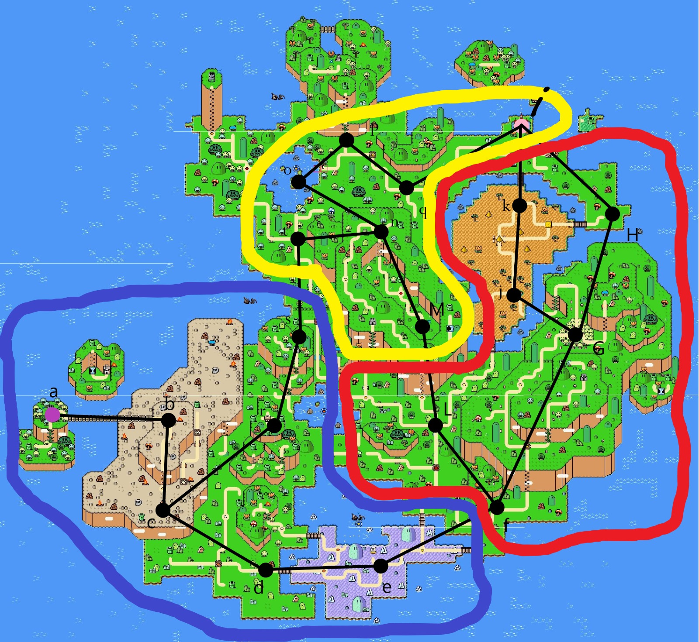

# Algoritmo de Dijkstra para Encontrar o Menor Caminho de A a I no mapa do jogo Mario.

Este projeto demonstra como usar o algoritmo de Dijkstra para encontrar o menor caminho possível de um nó A para um nó I em um grafo previamente definido em Python.

## Equipe

- Pedro Henrique Serafini (RA: 172211008)
- Rodrigo De Souza Alves (RA: 172211874)
- Leonardo Rebouças Busato (RA: 172213039)

## Descrição do Grafo

O grafo é representado da seguinte maneira:

- Nó de origem: A
- Nó de destino: I

## Executando o Algoritmo

Para executar o algoritmo de Dijkstra e encontrar o menor caminho de A a I, siga as etapas abaixo:

1. **Defina o Grafo**: Represente o grafo com seus pesos e conexões. Você pode usar uma estrutura de dados em Python, por exemplo, um dicionário, para representar o grafo.

2. **Escolha o Nó de Origem e Destino**: Defina o nó de origem (A) e o nó de destino (I) para encontrar o caminho mais curto.

3. **Implemente o Algoritmo de Dijkstra**: Utilize uma função ou código para calcular o menor caminho usando o algoritmo de Dijkstra. Você pode basear-se nas implementações fornecidas anteriormente.

4. **Execute o Código**: Execute o código para encontrar o caminho mais curto.

5. **Resultados**: O algoritmo de Dijkstra fornecerá o caminho mais curto e a distância entre os nós de origem e destino.

## Exemplo de Resultado

Suponha que o algoritmo seja executado e forneça o seguinte resultado:

- Caminho mais curto de A para I: A -> B -> C -> I
- Distância: 8
